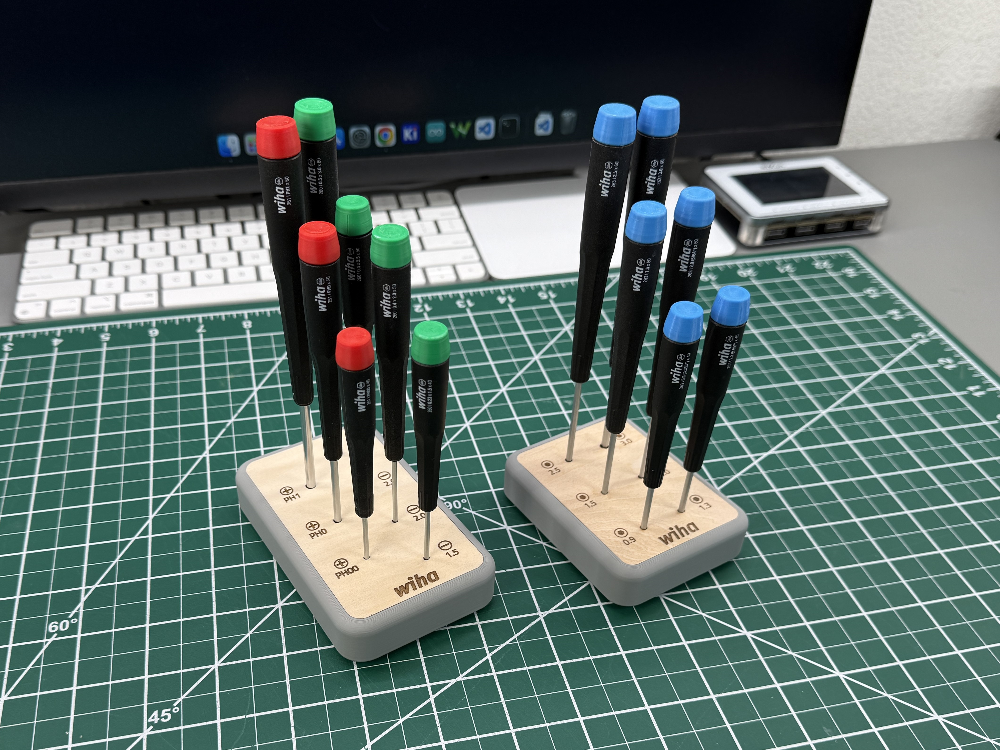

# Wiha Precision Screwdriver Stand

A stand to hold Wiha precision screwdrivers where they can be neatly organized, easily identified and conveniently accessed. The base is weighted and has anti slip feet. The drivers have custom, color coded end caps.

More information can be found at the blog post [here](https://badar.tech/2024/09/28/wiha-precision-screwdriver-stand/). 